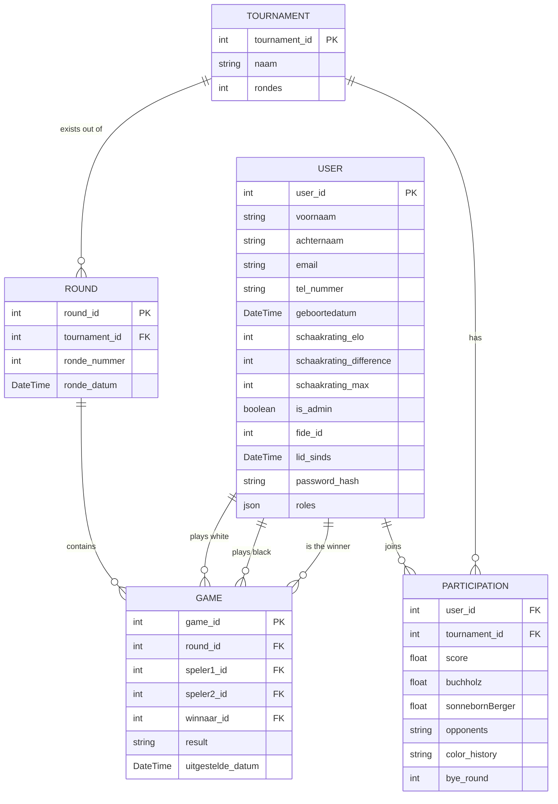
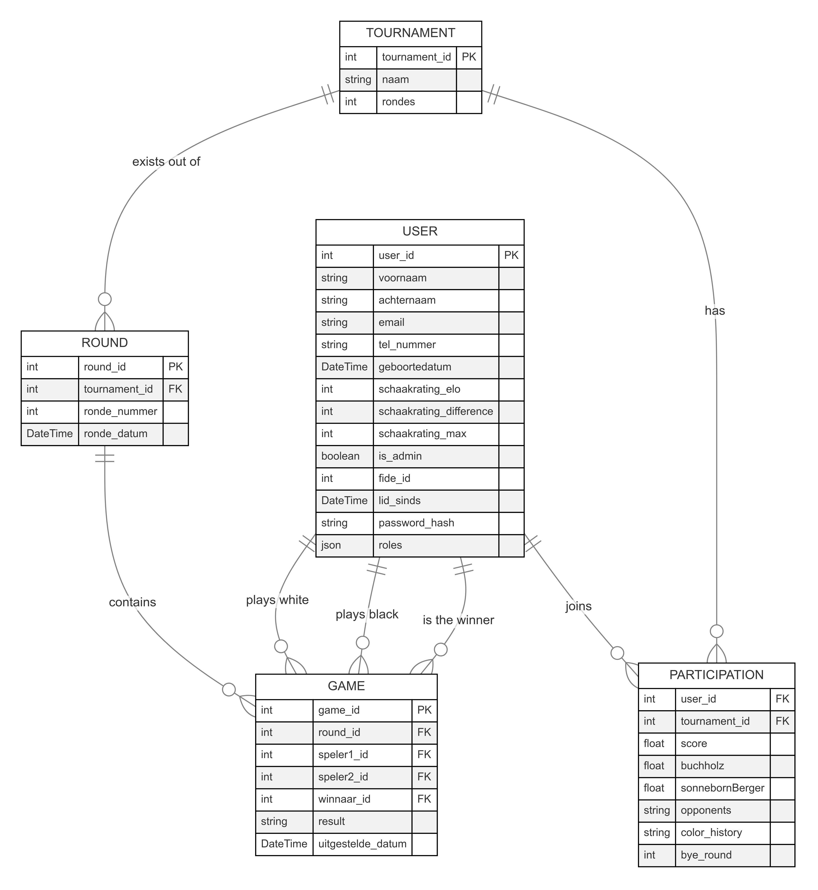
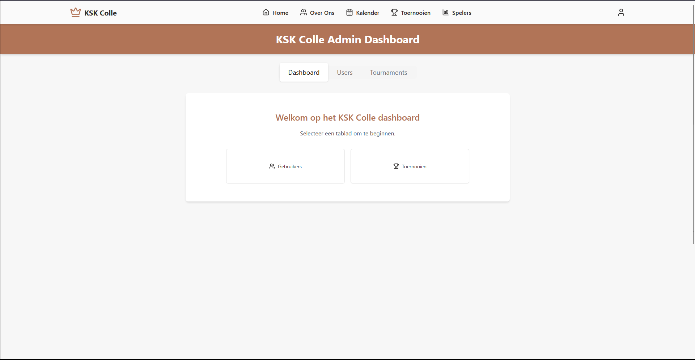
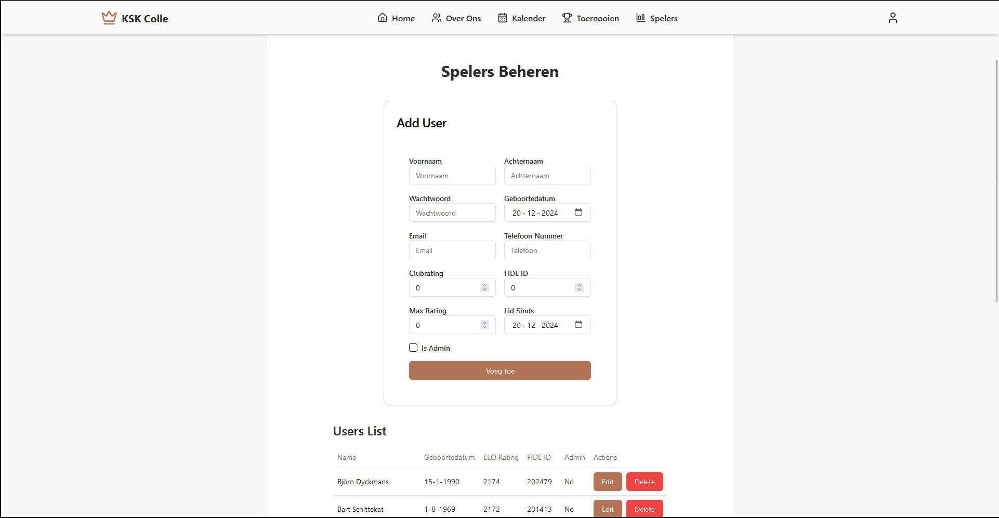
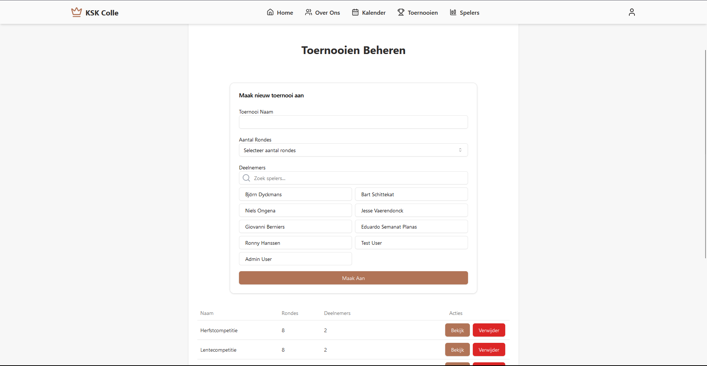
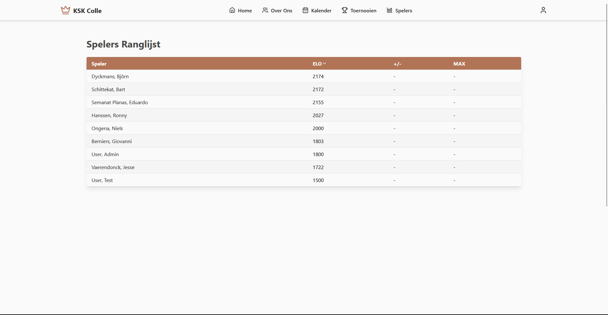
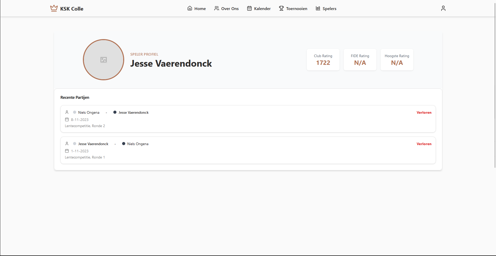
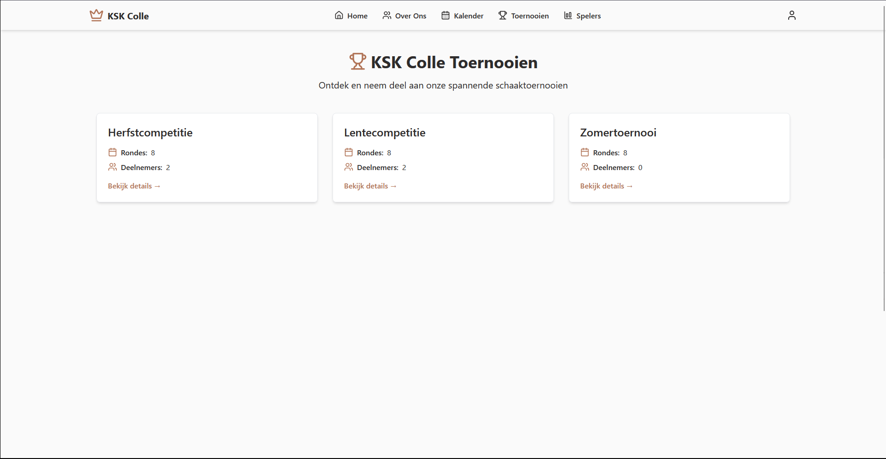
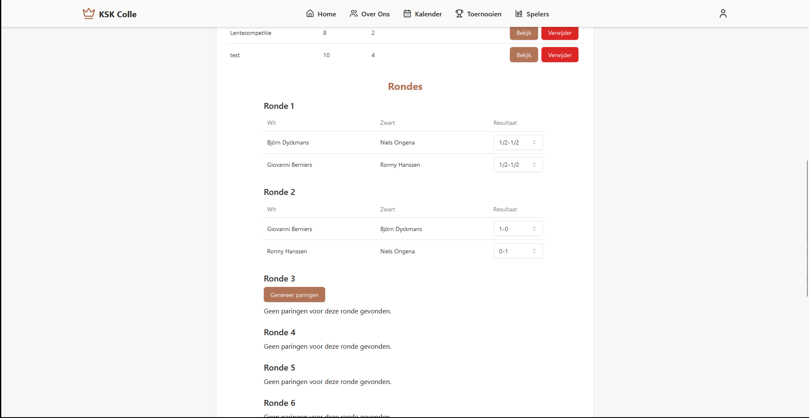
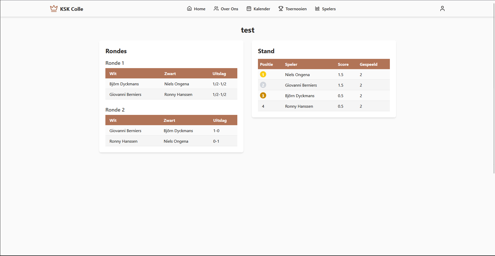

# Dossier

> Duid aan welke vakken je volgt en vermeld voor deze vakken de link naar jouw GitHub repository. In het geval je slechts één vak volgt, verwijder alle inhoud omtrent het andere vak uit dit document.
> Lees <https://github.com/adam-p/markdown-here/wiki/Markdown-Cheatsheet> om te weten hoe een Markdown-bestand opgemaakt moet worden.
> Verwijder alle instructies (lijnen die starten met >).

- Student: Jesse Vaerendonck
- Studentennummer: 202399060
- E-mailadres: <mailto:jesse.vaerendonck@student.hogent.be>
- Demo: <DEMO_LINK_HIER>
- GitHub-repository: <https://github.com/HOGENT-frontendweb/frontendweb-2425-Jessevdonck.git>
- Front-end Web Development
  - Online versie: <https://frontendweb-kskcolle.onrender.com>
- Web Services:
  - Online versie: <https://kskcolle-backend.onrender.com>

## Logingegevens

### Lokaal
**Standaard User**
- Gebruikersnaam/e-mailadres: testuser@mail.com
- Wachtwoord: 12345678
**Admin User**
- Gebruikersnaam/e-mailadres: adminuser@mail.com
- Wachtwoord: 12345678

### Online

**Standaard User**
- Gebruikersnaam/e-mailadres: testuser@mail.com
- Wachtwoord: 12345678
**Admin User**
- Gebruikersnaam/e-mailadres: adminuser@mail.com
- Wachtwoord: 12345678

> Vul eventueel aan met extra accounts voor administrators of andere rollen.

## Projectbeschrijving

> Omschrijf hier duidelijk waarover jouw project gaat. Voeg een domeinmodel (of EERD) toe om jouw entiteiten te verduidelijken.

Voor mijn project heb ik gekozen om de site van de schaakclub KSK Colle een "make over" te geven. Deze site dient in de eerste plaats om de nieuwkomers duidelijk te maken wat de schaakclub doet en waarvoor het staat. Ten tweede dient de site ook voor leden- en toernooibeheer. Dit houdt in dat een admin via een dashboard moet kunnen maken dat er toernooien en leden aangemaakt, aangepast en verwijderd moeten kunnen worden. Dit gebeurt allemaal via een apart dashboard waar alleen mensen met de rol "admin" toegang tot hebben. Normale leden hebben overigens een apart profiel waar ze snel hun "rating" en 5 meest recent gespeelde games kunnen zien. Ingelogde gebruikers hebben dan ook toegang om andere profielen van spelers waar te nemen.

**ERD in Mermaid:**

  
  
ERD ⬆️

## Screenshots

> Voeg enkele (nuttige!) screenshots toe die tonen wat de app doet.
> Dit is weinig zinvol indien je enkel Web Services volgt, verwijder dan deze sectie.

  
  
Admin Dashboard Landing Page ⬆️
 
  
  
Admin Dashboard User Page ⬆️

  
  
Admin Dashboard Tournament Page ⬆️

  
  
Player Overview ⬆️

  
  
Profile Page ⬆️

  
  
Tournament Overview ⬆️

  
  
Generate Pairings And Edit Results ⬆️

  
  
Tournament Standings ⬆️

## API calls

> Maak hier een oplijsting van alle API cals in jouw applicatie. Groepeer dit per entiteit. Hieronder een voorbeeld.
> Dit is weinig zinvol indien je enkel Front-end Web Development volgt, verwijder dan deze sectie.
> Indien je als extra Swagger koos, dan voeg je hier een link toe naar jouw online documentatie. Swagger geeft nl. exact (en nog veel meer) wat je hieronder moet schrijven.

#### Health
- `GET /api/ping`: Ping de server
- `GET /api/version`: Geeft de informatie over de server versie

#### Session
- `POST /api/sessions`: Logt de gebruiker in
  
#### Users

- `GET /api/users`: Alle gebruikers ophalen
- `GET /api/users/publicUsers`: Alle gebruikers ophalen zonder sensitieve informatie
- `GET /api/users/:user_id`: Gebruiker met een bepaald ID ophalen
- `GET /api/users/by-name`: Gebruiker met een bepaalde naam ophalen
- `POST /api/users`: Maak een nieuwe gebruiker aan
- `PUT /api/users/:user_id`: Update een bestaande gebruiker
- `PUT /api/users/:user_id/password`: Update het wachtwoord van een bestaande gebruiker
- `DELETE /api/users/:user_id`: Verwijder een specifieke gebruiker

#### Toernooien

- `GET /api/tournaments`: Alle toernooien ophalen
- `GET /api/tournaments/:tournament_id`: Toernooi met specifiek ID ophalen
- `POST /api/tournaments`: Maak een nieuw toernooi aan
- `POST /api/tournaments/tournament_id/pairings/roundNumber`: Maak paringen aan voor een bepaalde ronde
- `PUT /api/tournaments/:tournament_id`: Toernooi met specifiek ID aanpassen
- `DELETE /api/tournaments/:tournament_id`: Toernooi met specifiek ID verwijderen

#### Rondes

- `GET /api/rondes/tournaments`: Alle rondes ophalen
- `GET /api/rondes/:tournament_id/rondes`: Geef alle rondes van een bepaald toernooi
- `GET /api/rondes/:round_id`: Geef ronde met een specifiek ID
- `POST /api/tournaments/:tournament_id/rondes`: Maak een nieuwe ronde aan
- `PUT /api/rondes/:round_id`: Update een ronde met specifiek ID
- `DELETE /api/rondes/:round_id`: Verwijder ronde met specifiek ID

#### Spellen

- `GET /api/spel`: Alle spellen ophalen
- `GET /api/spel/:game_id`: Haal een spel met specifiek ID op
- `GET /api/spel/speler/user_id`: Haal alle spellen op van een specifieke user.
- `POST /api/spel`: Maak een nieuw spel
- `PUT /api/spel/:game_id`: Update een spel met specifiek ID
- `DELETE /api/spel/:game_id`: Verwijder een spel met specifiek ID

## Behaalde minimumvereisten

> Duid per vak aan welke minimumvereisten je denkt behaald te hebben

### Front-end Web Development

#### Componenten

- [x] heeft meerdere componenten - dom & slim (naast login/register)
- [x] applicatie is voldoende complex
- [x] definieert constanten (variabelen, functies en componenten) buiten de component
- [x] minstens één form met meerdere velden met validatie (naast login/register)
- [x] login systeem

#### Routing

- [x] heeft minstens 2 pagina's (naast login/register)
- [x] routes worden afgeschermd met authenticatie en autorisatie

#### State management

- [x] meerdere API calls (naast login/register)
- [x] degelijke foutmeldingen indien API-call faalt
- [x] gebruikt useState enkel voor lokale state
- [x] gebruikt gepast state management voor globale state - indien van toepassing

#### Hooks

- [x] gebruikt de hooks op de juiste manier

#### Algemeen

- [x] een aantal niet-triviale én werkende e2e testen
- [x] minstens één extra technologie
- [x] node_modules, .env, productiecredentials... werden niet gepushed op GitHub
- [x] maakt gebruik van de laatste ES-features (async/await, object destructuring, spread operator...)
- [x] de applicatie start zonder problemen op gebruikmakend van de instructies in de README
- [x] de applicatie draait online
- [x] duidelijke en volledige README.md
- [x] er werden voldoende (kleine) commits gemaakt
- [x] volledig en tijdig ingediend dossier

### Web Services

#### Datalaag

- [x] voldoende complex en correct (meer dan één tabel (naast de user tabel), tabellen bevatten meerdere kolommen, 2 een-op-veel of veel-op-veel relaties)
- [x] één module beheert de connectie + connectie wordt gesloten bij sluiten server
- [x] heeft migraties - indien van toepassing
- [x] heeft seeds

#### Repositorylaag

- [x] definieert één repository per entiteit - indien van toepassing
- [x] mapt OO-rijke data naar relationele tabellen en vice versa - indien van toepassing
- [x] er worden kindrelaties opgevraagd (m.b.v. JOINs) - indien van toepassing

#### Servicelaag met een zekere complexiteit

- [x] bevat alle domeinlogica
- [x] er wordt gerelateerde data uit meerdere tabellen opgevraagd
- [x] bevat geen services voor entiteiten die geen zin hebben zonder hun ouder (bv. tussentabellen)
- [x] bevat geen SQL-queries of databank-gerelateerde code

#### REST-laag

- [x] meerdere routes met invoervalidatie
- [x] meerdere entiteiten met alle CRUD-operaties
- [x] degelijke foutboodschappen
- [x] volgt de conventies van een RESTful API
- [x] bevat geen domeinlogica
- [x] geen API calls voor entiteiten die geen zin hebben zonder hun ouder (bv. tussentabellen)
- [x] degelijke autorisatie/authenticatie op alle routes

#### Algemeen

- [x] er is een minimum aan logging en configuratie voorzien
- [x] een aantal niet-triviale én werkende integratietesten (min. 1 entiteit in REST-laag >= 90% coverage, naast de user testen)
- [x] node_modules, .env, productiecredentials... werden niet gepushed op GitHub
- [x] minstens één extra technologie die we niet gezien hebben in de les
- [x] maakt gebruik van de laatste ES-features (async/await, object destructuring, spread operator...)
- [x] de applicatie start zonder problemen op gebruikmakend van de instructies in de README
- [x] de API draait online
- [x] duidelijke en volledige README.md
- [x] er werden voldoende (kleine) commits gemaakt
- [x] volledig en tijdig ingediend dossier

## Projectstructuur

### Front-end Web Development

> Hoe heb je jouw applicatie gestructureerd (mappen, design patterns, hiërarchie van componenten, state...)?

Ik heb mij gehouden aan hoe men normaal NextJS hiërarchie onderhoudt. Er is een app folder waarin alle page folders zitten. Men heeft een components folder in de root app folder zitten die componenten die over heel de applicatie gebruikt worden bevat. Buiten dat heeft men ook nog componenten per 'page' folder waar men enkel componenten in heeft zitten die specifiek voor die pagina gebruikt worden.
 

Wat ik persoonlijk het meest handige vind aan NextJS is hoe men makkelijk aan Server Side Rendering kan doen. Ik heb hiervan zoveel mogelijk gebruik gemaakt als het ging over dynamische data die bv. afhankelijk was van authenticatie. In tegenstelling tot de SSR heb ik ook gebruik gemaakt van Client-Side Rendering wanner dit ging over pagina's die intensief steunde op interactie (bv. het dashboard).

De state management kan men vooral zien bij de authenticatie aangezien ik geen 'dark mode' geïntegreerd heb. 

Ik heb altijd geprobeerd om me aan de 'best practices' te houden, maar dit was niet altijd even makkelijk omdat je snel "verdrinkt" in je eigen code en bestanden. Ondanks dat vermoed ik wel dat dit grotendeels in orde zal zijn.

### Web Services
> Hoe heb je jouw applicatie gestructureerd (mappen, design patterns...)?

 Ik heb geprobeerd alles overzichtelijk te houden door een zeer strakke en heldere mappenstructuur aan te houden. Zo heb ik een REST laag met alle endpoints en de bijhorende service map waar alle domeinlogica zich in verschuilt. Er is ook maar 1 bestand dat de server aanmaakt en die steunt dan op helper bestanden zoals bv. installMiddlewares om in dit geval de middlewares te installeren. Alle sensitieve informatie staat net zoals bij het front-end gedeelte in een .env bestand zodat dit niet toegangelijk is voor bezoekers.
 

## Extra technologie

### Front-end Web Development

> Wat is de extra technologie? Hoe werkt het? Voeg een link naar het npm package toe!
  
Ik heb gekozen voor <a href="https://www.npmjs.com/package/next" target="_blank" rel="noopener noreferrer">NextJS</a>. Dit is een ander framework dan dat we in de les gezien hebben en dit prefereerde ik boven React Native omdat bepaalde technologieën makkelijker te gebruiken zijn in dit framework zoals de routing en SSR en CSR 

    

### Web Services

> Wat is de extra technologie? Hoe werkt het? Voeg een link naar het npm package toe!
  
Ik heb hier gekozen voor <a href="https://www.npmjs.com/package/apidoc" target="_blank" rel="noopener noreferrer">apiDoc</a> i.p.v. Swagger. Ik vond apiDoc zeer gebruiksvriendelijk om te gebruiken aangezien men de NPM package moest installeren, een config moest toevoegen en dan de documentatie in de bestanden kon toevoegen. Eens je overal de documentatie had bijgezet kon men een simpel commando (apidoc -i src -o apidoc) uitvoeren om het te laten genereren. Dan was het nog kwestie van het toegangelijk te maken via routing en dit was zo simpel als een lijn code toevoegen in het installMiddlewares.ts bestand. (app.use(serve('apidoc'));).

## Gekende bugs

### Front-end Web Development

> Zijn er gekende bugs?
Eens de token vervalt dan past de navigatiebalk zich niet aan en lijkt het alsof je nog steeds bent ingelogd.

### Web Services

> Zijn er gekende bugs?
/

## Reflectie

> Wat vond je van dit project? Wat heb je geleerd? Wat zou je anders doen? Wat vond je goed? Wat vond je minder goed?
> Wat zou je aanpassen aan de cursus? Wat zou je behouden? Wat zou je toevoegen?

Dit was een project waar je grotendeels wat in werd gegooid, maar dit zorgde ervoor dat je echt moest snappen met wat je bezig was in tegenstelling tot "gewone" lessen krijgen. Ik kan dus gerust zeggen dat ik enorm veel bijgeleerd heb, vooral over het backend gedeelte omdat ik persoonlijk vind dat hier toch altijd wat minder informatie online over te vinden is. De cursus aan zich vond ik ook vrij goed, maar ik vind dat het misschien iets te veel "copy en paste" is bij sommige delen zonder een uitgebreide uitleg waarom je bepaalde dingen op een bepaalde manier moet doen. Dit zorgde voor heel wat tijdsverlies als je de "waarom" erachter wou weten.

